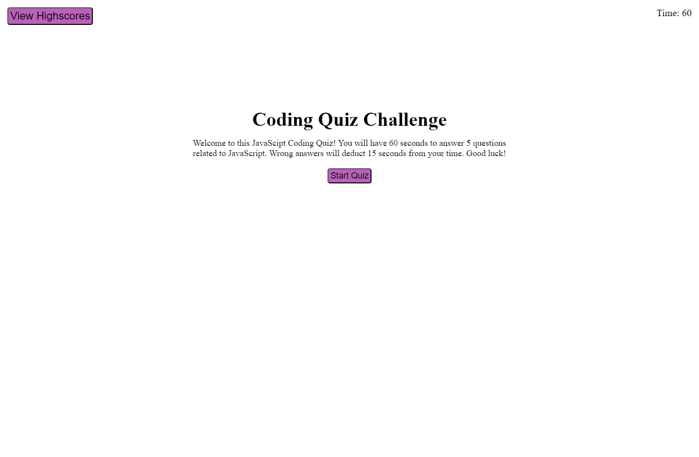
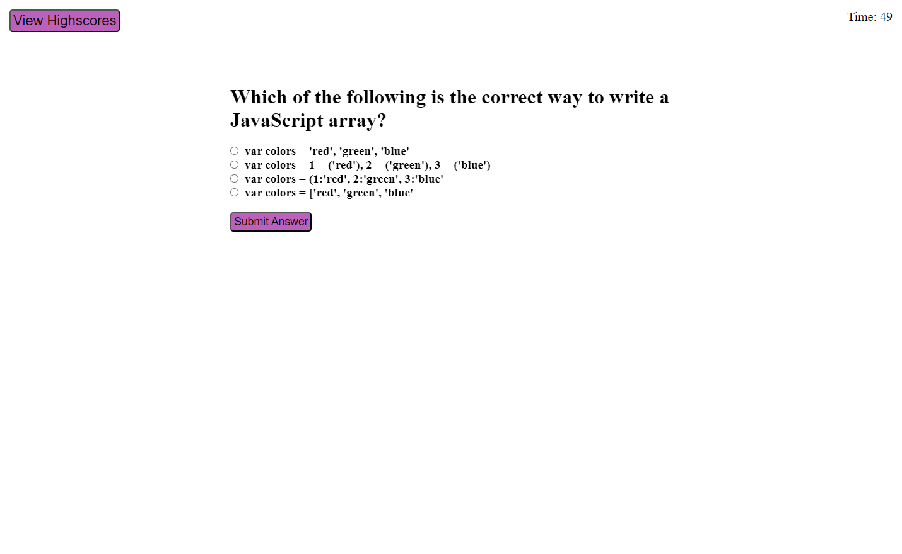
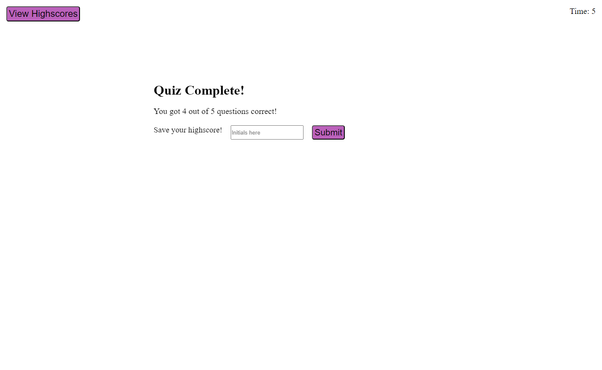

# code-quiz

## Description

The purpose of this project was to utilize the tools we have learned from Web APIs. This includes things such as functional timers, box flipping, and usage of local storage. This project required us to create a coding quiz with a time limit that will decrease with incorrect answers as well as the ability to store your score and initials into the local storage in order to view it in the highscores leaderboard.

## Usage

<ul>
    <li>
        <a href="https://github.com/Soleiles/code-quiz">Repository</a>
    </li>
    <li>
        <a href="https://soleiles.github.io/code-quiz/">Live Site</a>
    </li>
</ul>

## Sources

<ul>
    <li>
        <a href="https://www.w3schools.com/">w3schools</a>
    </li>
</ul>

## License

Refer to license in the repository.